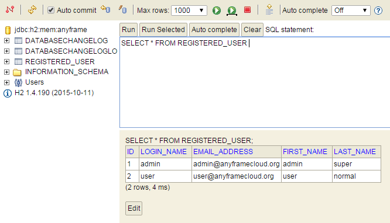

Getting Started
~~~~~~~~~~~~~~

= Building RESTful API Service

== 목차
..... *<<intro>>*

..... *<<main1>>*
        <<section1-1>>::
        
        <<section1-2>>::

..... *<<main2>>*
        <<section2-1>>::
			<<section2-1-1>>

        <<section2-2>>::
            <<section2-2-1>> +
            <<section2-2-2>> +
			<<section2-2-3>> +
			<<section2-2-4>> +
			<<section2-2-5>> +
			<<section2-2-6>>

..... *<<outro>>*

// Page 구분
<<<

[[intro]]
== Introduce
*Spring Boot 기반의 link:http://spring.io/understanding/REST[REST] API 서비스 구축을 위한 레퍼런스 문서입니다.*

NOTE: RESTful API 설계 가이드는 link:1_design_restful_api.adoc[RESTful API 설계 가이드](link:1_design_restful_api.pdf[PDF])를 참조 바랍니다.

=== Features
* Spring Boot를 이용하여 RESTful API Service를 구축합니다.
* API를 호출하는 다양한 Client의 Sample code를 제공합니다.
* link:https://www.w3.org/TR/cors[CORS(Cross-Origin Resource Sharing)]를 위한 해결책이 있습니다.
* 사용자 인증을 위해 link:http://oauth.net/2/[Oauth2.0] Client로써의 API Service를 구축합니다.

=== Need
* 약 15분의 시간
* Maven 3.0+
* java 7+
* IDE

// Page 구분
<<<

[[main1]]
== Architecture

[[section1-1]]
=== 1. 기존 Web Application
* 기존의 일반적인 Server Page 방식의 Web Application은 컴파일한 Page로 응답하기 때문에,
* Data만 주고 받기 위해 다른 방법을 강구해야만 했습니다.(별로 필요하지도 않았음)
* 예> 기상청으로부터 날씨정보를 받아오려면 OOO.jsp 파일로 부터 데이터를 추출하는 코드가 필요했습니다.

.기존 Web Application의 형태

[[section1-2]]
=== 2. RESTful API Service
* Client가 더욱 다양해지고 Web표준이 정립되면서 UI와 Data가 분리되었습니다.
* 이제 다양한 Client들에 동일한 Data로 응답하기 위해 Webservice 아키텍처가 Web Application에도 적용됩니다.

.RESTful Webservice API Service
image:image_api_server_archi.png[RESTful Webservice API Service]

// Page 구분
<<<

[[main2]]
== Build REST API Service
Spring Boot를 사용하여 손쉽게 API 서비스를 구축해 보겠습니다.

[[section2-1]]
=== 1. Clone Repository
----
git clone http://70.121.244.190/gitnsam/anyframe-cloud/rest-service.git
----

[[section2-1-1]]
=== 1.(1) 완성된 프로젝트
* 완성된 코드는 **_/complete_**에서 확인 할 수 있습니다.
* 개발 가이드를 실습 해보시려면 **_/initial_**을 본인의 IDE에 **_Maven Import_** 해주세요

.완성된 코드 실행하기
....
cd rest-service/complete
mvn spring-boot:run
....

// Page 구분
<<<

[[section2-2]]
=== 2. API 서비스 개발하기
* 사용자 정보를 제공하는 API 서비스를 개발 해보겠습니다.
* 본 섹션에서는 Spring Boot를 기반으로 최소 기능을 구현합니다.

.제공할 자원(사용자 정보)
|===
|속성명 |타입 |설명
|id |long |시스템에서 관리되는 사용자 ID
|loginName |string |로그인 시 사용되는 이름
|emailAddress |string |사용자의 이메일 주소
|firstName |string |사용자의 이름
|lastName |string |사용자의 성
|===

[id="api_list",reftext="API 목록"]
.API 목록
|===
|URL |Method |Request |Response

|/user |POST |
POST /user HTTP/1.1  +
Conten-Type: application/json +
{ +
{nbsp}{nbsp}{nbsp} "loginName":"anyframecloud", +
{nbsp}{nbsp}{nbsp} "emailAddress":"cloud@api.com", +
{nbsp}{nbsp}{nbsp} "firstName":"cloud", +
{nbsp}{nbsp}{nbsp} "lastName":"anyframe" +
} |
HTTP/1.1 201 CREATED  +
{ +
{nbsp}{nbsp}{nbsp} "userId":"OOO", +
{nbsp}{nbsp}{nbsp} "loginName":"anyframecloud", +
{nbsp}{nbsp}{nbsp} "emailAddress":"cloud@api.com" +
}

|/user/{userId} |GET |
GET /user/{userId} HTTP/1.1
|
HTTP/1.1 200 OK +
{ +
{nbsp}{nbsp}{nbsp} "loginName":"anyframecloud", +
{nbsp}{nbsp}{nbsp} "emailAddress":"cloud@api.com", +
{nbsp}{nbsp}{nbsp} "firstName":"cloud", +
{nbsp}{nbsp}{nbsp} "lastName":"anyframe" +
}

|/user |PUT |
PUT /user/{userId} HTTP/1.1  +
Conten-Type: application/json +
{ +
{nbsp}{nbsp}{nbsp} "loginName":"anyframecloud", +
{nbsp}{nbsp}{nbsp} "emailAddress":"cloud@api.com", +
{nbsp}{nbsp}{nbsp} "firstName":"cloud", +
{nbsp}{nbsp}{nbsp} "lastName":"anyframe" +
} |
HTTP/1.1 204 No Content

|/user/{userId} |DELETE |
DELETE /user/{userId} HTTP/1.1
|
HTTP/1.1 205 Reset Content

|===

NOTE: API를 통해 서버의 자원을 제공한다는 관점에서 *Resource Server* 라는 용어를 사용하기도 합니다.

[[section2-2-1]]
==== 2.(1) pom.xml

===== 2.(1).1) **_spring-boot-starter-web_** 추가

.pom.xml
[source, xml]
----
<?xml version="1.0" encoding="UTF-8"?>
<project xmlns="http://maven.apache.org/POM/4.0.0" xmlns:xsi="http://www.w3.org/2001/XMLSchema-instance"
	xsi:schemaLocation="http://maven.apache.org/POM/4.0.0 http://maven.apache.org/xsd/maven-4.0.0.xsd">
	<modelVersion>4.0.0</modelVersion>

	<groupId>org.anyframe.cloud</groupId>
	<artifactId>rest-service</artifactId>
	<version>0.0.1-SNAPSHOT</version>
	<packaging>jar</packaging>

	<name>rest-service</name>
	<description>Demo project for RESTful API Service</description>

	<parent>
		<groupId>org.springframework.boot</groupId>
		<artifactId>spring-boot-starter-parent</artifactId>
		<version>1.3.1.RELEASE</version>
		<relativePath/> <!-- lookup parent from repository -->
	</parent>

	<properties>
		<project.build.sourceEncoding>UTF-8</project.build.sourceEncoding>
		<java.version>1.7</java.version>
	</properties>

	<dependencies>
		<dependency>
			<groupId>org.springframework.boot</groupId>
			<artifactId>spring-boot-starter-web</artifactId>
		</dependency>

		<dependency>
			<groupId>org.springframework.boot</groupId>
			<artifactId>spring-boot-starter-data-jpa</artifactId>
		</dependency>
		<dependency>
			<groupId>org.liquibase</groupId>
			<artifactId>liquibase-core</artifactId>
		</dependency>
		<dependency>
			<groupId>com.h2database</groupId>
			<artifactId>h2</artifactId>
			<scope>compile</scope>
		</dependency>

		<dependency>
			<groupId>org.springframework.boot</groupId>
			<artifactId>spring-boot-starter-test</artifactId>
			<scope>test</scope>
		</dependency>
	</dependencies>

	<build>
		<plugins>
			<plugin>
				<groupId>org.springframework.boot</groupId>
				<artifactId>spring-boot-maven-plugin</artifactId>
			</plugin>
		</plugins>
	</build>
</project>
----
NOTE: Application을 쉽게 구동하기 위해서 **_spring-boot-maven-plugin_**을 추가해 주었습니다.

NOTE: JPA 및 H2DB, Liquibase 설정은 본 가이드에서 다루는 내용이 아니므로 생략합니다.(link:http://docs.spring.io/spring-data/jpa/docs/1.3.0.RELEASE/reference/html/jpa.repositories.html[JPA Repository 참고])

[[section2-2-2]]
==== 2.(2) Domain Class
* 도메인 설계에 따라 Domain Class를 작성해보겠습니다.

===== 2.(2).1) *_org.anyframe.cloud.restservice.domain.User_* Class를 생성

.User.class
[source, java]
----
package org.anyframe.cloud.restservice.domain;

import javax.persistence.Column;
import javax.persistence.Entity;
import javax.persistence.Id;
import javax.persistence.Table;

@Entity
@Table(name = "registered_user")
public class User {

    @Id
    private String id;

    @Column(unique = true, nullable = false)
    private String loginName;

    @Column(unique = true, nullable = false)
    private String emailAddress;

    private String firstName;

    private String lastName;

    public User() {
    }

    public User(String id, String loginName, String emailAddress, String firstName, String lastName) {
        this.id = id;
        this.loginName = loginName;
        this.emailAddress = emailAddress;
        this.firstName = firstName;
        this.lastName = lastName;
    }

    public String getId() {
        return id;
    }

    public void setId(String id) {
        this.id = id;
    }

    public String getLoginName() {
        return loginName;
    }

    public void setLoginName(String loginName) {
        this.loginName = loginName;
    }

    public String getEmailAddress() {
        return emailAddress;
    }

    public void setEmailAddress(String emailAddress) {
        this.emailAddress = emailAddress;
    }

    public String getFirstName() {
        return firstName;
    }

    public void setFirstName(String firstName) {
        this.firstName = firstName;
    }

    public String getLastName() {
        return lastName;
    }

    public void setLastName(String lastName) {
        this.lastName = lastName;
    }

    @Override
    public String toString() {
        return "User{" +
                "id='" + id + '\'' +
                ", loginName='" + loginName + '\'' +
                ", emailAddress='" + emailAddress + '\'' +
                ", firstName='" + firstName + '\'' +
                ", lastName='" + lastName + '\'' +
                '}';
    }
}
----
.. Domain Class는 Database에 매핑됩니다.
.. 기본적인 Getter, Setter Method와 toString()만 존재하지만 *equals()*, *hashCode()* 등의 유틸성 메소드를 추가해도 무관합니다.

NOTE: @Entity, @Id, @Column, @Table은 JPA관련 Annotation 입니다.

[[section2-2-3]]
==== 2.(3) Controller Class
* API 목록에 따라 Controller Class를 작성해보겠습니다.
* 가이드 편의상 POST 요청에 대한 개발 가이드를 제공합니다.
* 완성된 코드를 통해 PUT, DELETE, GET 소스를 확인하시길 바랍니다.

===== 2.(3).1) *_org.anyframe.cloud.restservice.controller.UserContoller_* Class 생성

.UserContoller.class
[source, java]
----
package org.anyframe.cloud.restservice.controller;

import org.slf4j.Logger;
import org.slf4j.LoggerFactory;
import org.springframework.beans.factory.annotation.Autowired;
import org.springframework.http.HttpStatus;
import org.springframework.web.bind.annotation.*;

@RestController
public class UserController {

    private static final Logger logger = LoggerFactory.getLogger(UserController.class);

    @Autowired
    private UserService userService;

    @RequestMapping(value = "/user", method = {RequestMethod.POST})
    @ResponseStatus(HttpStatus.CREATED)
    public User registerUser(@RequestBody User newUser) {

        User registeredUser = userService.registerUser(newUser);

        return registeredUser;
    }

}
----
.. @RestController
** Spring 4.0 부터 추가된 Spring MVC에서 사용되는 Annotation.
** @Controller + @ResponseBody를 대체하기 위해 새롭게 추가되었습니다.
** Return 값은 View 없이 특정 Type의 메시지가 Response Body에 직접 쓰여집니다.

.. @RequestMapping
** method: Http Request Method(POST, PUT, DELETE, GET...)
** value: 매핑되는 context root 이후의 URL이며, Method의 값은 Class의 @RequestMapping(value)를 상속합니다.

.. @RequestBody
** RequestBody의 내용이 Message Converter를 통해 Domain Class에 매핑됩니다.

NOTE: Userservice Complie 오류가 발생합니다.

[[section2-2-4]]
==== 2.(4) Service Class
* 실제로 Business Logic을 담당하는 서비스 클래스를 작성해보겠습니다.

===== 2.(4).1) *_org.anyframe.cloud.restservice.service.UserService_* Interface 생성

.UserService.class
[source, java]
----
package org.anyframe.cloud.restservice.service;

import User;

public interface UserService {

    User registerUser(User newUser);

}
----

===== 2.(4).2) *_org.anyframe.cloud.restservice.service.impl.UserServiceImpl_* Class 생성

.UserServiceImpl.class
[source, java]
----
package org.anyframe.cloud.restservice.service.impl;

import User;
import RegisteredUserJpaRepository;
import UserService;
import IdGenerator;
import org.slf4j.Logger;
import org.slf4j.LoggerFactory;
import org.springframework.beans.factory.annotation.Autowired;
import org.springframework.stereotype.Service;

@Service
public class UserServiceImpl implements UserService {

    private static final Logger logger = LoggerFactory.getLogger(UserServiceImpl.class);

    @Autowired
    protected RegisteredUserJpaRepository registeredUserRepository;

    @Override
    public User registerUser(User newUser) {

        logger.info("$$$ registerUser - new user : ".concat(newUser.toString()));

        newUser.setId(IdGenerator.generateId());

        User registeredUser = registeredUserRepository.save(newUser);

        logger.info("$$$ registerUser - registered user : ".concat(registeredUser.toString()));

        return registeredUser;
    }

}
----

[[section2-2-5]]
==== 2.(5) Method 추가하기
* 동일하게 GET, PUT, DELETE에 해당되는 메소드를 작성합니다.

[[section2-2-6]]
==== 2.(6) Data Transfer Object 작성하기
* Sample Application의 패키지 구조는 크게 세가지로 나눌 수 있습니다.
  .. controller
  .. service
  .. repository
* 기본적으로 service과 repository는 DB와 매핑되는 Domain 객체를 사용하지만,
* RESTful webservice API로 노출되는 객체로 Domain 객체를 사용하는 것은 API 사용자(Client)에게는 큰 불편입니다.
* *_즉, DTO는 API 스펙과 매핑되는 객체입니다._*

[NOTE]
.Data Transfer Object가 필요한 이유
===================================
. API 스펙은 버전별로 변화가 거의 없어야 하는데 DB 모델링 변화에 따라 Domain 객체는 수시로 변할 수 있다.
. Domain 객체는 DB와 매핑되므로 사용자에게 불필요한 시스템 컬럼이 포함되어있다.
. 동일한 Domain의 정보를 제공하더라도, API 별 특성에 따라 제공하고자 하는 데이터가 상이한 경우가 있다.
===================================

.새롭게 추가될 2개의 Data Transfer Object
. 회원가입 사용자 DTO: RegisteredUser
  .. POST /user의 Request
  .. GET /user/{userId}의 Response
. 사용자 계정 DTO: UserAccount
  .. POST /user의 Response

===== 2.(6).1) *_org.anyframe.cloud.restservice.controller.dto.RegisteredUser_* Class 생성

.RegisteredUser.class
[source, java]
----
package org.anyframe.cloud.restservice.controller.dto;

public class RegisteredUser {

    private String loginName;

    private String emailAddress;

    private String firstName;

    private String lastName;

    public RegisteredUser() {
    }

    public RegisteredUser(String loginName, String emailAddress, String firstName, String lastName) {
        this.loginName = loginName;
        this.emailAddress = emailAddress;
        this.firstName = firstName;
        this.lastName = lastName;
    }

    public String getLoginName() {
        return loginName;
    }

    public void setLoginName(String loginName) {
        this.loginName = loginName;
    }

    public String getEmailAddress() {
        return emailAddress;
    }

    public void setEmailAddress(String emailAddress) {
        this.emailAddress = emailAddress;
    }

    public String getFirstName() {
        return firstName;
    }

    public void setFirstName(String firstName) {
        this.firstName = firstName;
    }

    public String getLastName() {
        return lastName;
    }

    public void setLastName(String lastName) {
        this.lastName = lastName;
    }

    @Override
    public String toString() {
        return "RegisteredUser{" +
                "loginName='" + loginName + '\'' +
                ", emailAddress='" + emailAddress + '\'' +
                ", firstName='" + firstName + '\'' +
                ", lastName='" + lastName + '\'' +
                '}';
    }
}

----

===== 2.(6).2) *_org.anyframe.cloud.restservice.controller.dto.UserAccount_* Class 생성

.UserAccount.class
[source, java]
----
package org.anyframe.cloud.restservice.controller.dto;

public class UserAccount {

    private String userId;

    private String loginName;

    private String emailAddress;

    public UserAccount() {
    }

    public UserAccount(String userId, String loginName, String emailAddress) {
        this.userId = userId;
        this.loginName = loginName;
        this.emailAddress = emailAddress;
    }

    public String getUserId() {
        return userId;
    }

    public void setUserId(String userId) {
        this.userId = userId;
    }

    public String getLoginName() {
        return loginName;
    }

    public void setLoginName(String loginName) {
        this.loginName = loginName;
    }

    public String getEmailAddress() {
        return emailAddress;
    }

    public void setEmailAddress(String emailAddress) {
        this.emailAddress = emailAddress;
    }

    @Override
    public String toString() {
        return "UserAccount{" +
                "userId='" + userId + '\'' +
                ", loginName='" + loginName + '\'' +
                ", emailAddress='" + emailAddress + '\'' +
                '}';
    }
}
----

===== 2.(6).3) DTO - Domain 매핑하기

.UserController.class
[source, java]
----
@RestController
public class UserController {

    private static final Logger logger = LoggerFactory.getLogger(UserController.class);

    @Autowired
    private UserService userService;

    @RequestMapping(value = "/user", method = {RequestMethod.POST})
    @ResponseStatus(HttpStatus.CREATED)
    public UserAccount registerUser(@RequestBody RegisteredUser registerUser) {

        User newUser = dtoToDomain(registerUser);

        User user = userService.registerUser(newUser);

        UserAccount userAccount = new UserAccount(user.getId()
                , user.getLoginName()
                , user.getEmailAddress());

        return userAccount;
    }

    private RegisteredUser domainToDto(User domain){
        RegisteredUser dto = new RegisteredUser(domain.getLoginName()
                , domain.getEmailAddress()
                , domain.getFirstName()
                , domain.getLastName());
        return dto;
    }

    private User dtoToDomain(RegisteredUser dto){
        User newUser = new User(null
                , dto.getLoginName()
                , dto.getEmailAddress()
                , dto.getFirstName()
                , dto.getLastName());
        return newUser;
    }

}
----
.. RegisteredUser, UserAccount Class
** API Spec에 맞게 디자인된 DTO Class 입니다.

.. domainToDto, dtoToDomain 메소드
** Domain 객체를 사용하는 Service 호출을 위해 매핑 역할을 수행합니다.
** DTO와 Domain을 매핑을 위해 Facade Layer를 추가할 수도 있지만, 그 역할을 Controller가 담당합니다.

[[section2-2-7]]
==== 2.(7) JPA Repository 작성하기
* 이번 섹션은 본 샘플 가이드에서 비중이 없는 부분이므로 참고만 바랍니다.
* H2 Database connection에 대한 설정은 이미 완료가 되어 있습니다.
* link:http://localhost:8081/console[H2 Console - http://localhost:8081/console]

===== 2.(7).1) *_org.anyframe.cloud.restservice.repository.RegisteredUserRepository_* Class 생성

.RegisteredUserRepository.class
[source, java]
----
package org.anyframe.cloud.restservice.repository;

import User;

public interface RegisteredUserRepository {

	User findByLoginName(String loginName);

	User findByEmailAddress(String emailAddress);

}
----
.. Domian 객체의 Id값을 이용한 기본적인 Select, Insert, Update, Delete 이외에 필요한 메소드를 선언합니다.
** link:http://docs.spring.io/spring-data/jpa/docs/1.3.0.RELEASE/reference/html/jpa.repositories.html[JPA Repository 참고]

===== 2.(7).2) *_org.anyframe.cloud.restservice.repository.jpa.RegisteredUserJpaRepository_* Class 생성

.RegisteredUserJpaRepository.class
[source, java]
----
package org.anyframe.cloud.restservice.repository.jpa;

import User;
import RegisteredUserRepository;
import org.springframework.data.jpa.repository.JpaRepository;

public interface RegisteredUserJpaRepository extends RegisteredUserRepository, JpaRepository<User, String> {
}
----
.. User Domain모델에 대한 JpaRepository를 생성합니다.

// Page 구분
<<<

[[outro]]
== Summary
굉장히 간단한 Spring Boot 기반의 RESTfull API Service 구축을 실습했습니다. +
link:3_building_restful_api_service_advanced.adoc[다음 가이드](link:3_building_restful_api_service_advanced.pdf[PDF])에서는
실제 솔루션에서 사용하기 위한 API Service 필수기능 구현에 대해 알아보도록 하겠습니다. +

API 서비스 테스트 방법에 대해서는 link:4_test_restful_api_service.adoc[Test 가이드](link:4_test_restful_api_service.pdf[PDF])에서 확인 하실수 있습니다.
