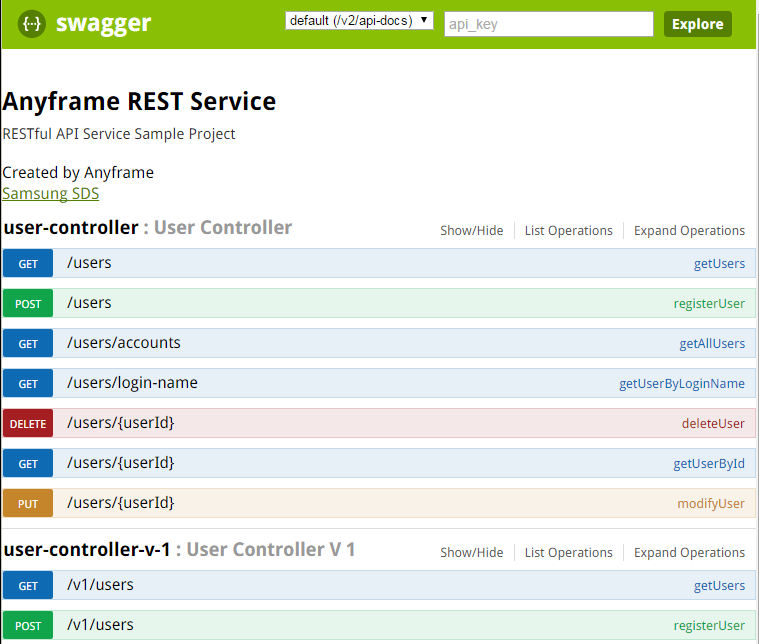
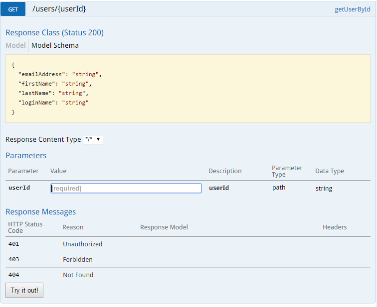

Getting Started
~~~~~~~~~~~~~~

= Building RESTful API Service

== 목차
..... *<<intro>>*

..... *<<main1>>*

        <<section1-1>>::
            <<section1-1-1>> +
            <<section1-1-2>> +
			<<section1-1-3>> +
			<<section1-1-4>> +
			<<section1-1-5>> +
			<<section1-1-6>> +
			<<section1-1-7>> +
			<<section1-1-8>>

        <<section1-2>>::
            <<section1-2-1>> +
            <<section1-2-2>> +
			<<section1-2-3>>

        <<section1-3>>::

        <<section1-4>>::

        <<section1-5>>::

        <<section1-6>>::
            <<section1-6-1>> +
            <<section1-6-2>> +
			<<section1-6-3>> +
			<<section1-6-4>> +
            <<section1-6-5>> +
            <<section1-6-6>>

        <<section1-7>>::
            <<section1-7-1>>

        <<section1-8>>::

..... *<<outro>>*

// Page 구분
<<<

[[intro]]
== Introduce
*Spring Boot 기반의 link:http://spring.io/understanding/REST[REST] API 서비스 구축을 위한 레퍼런스 문서입니다.*

NOTE: RESTful API 설계 가이드는 link:1_design_restful_api.adoc[REST API 설계 가이드](link:1_design_restful_api.pdf[PDF])를 참조 바랍니다.

=== Features
* 오류처리에 대한 방법이 있습니다.
* link:https://www.w3.org/TR/cors[CORS(Cross-Origin Resource Sharing)]를 위한 해결책이 있습니다.
* 사용자 인증을 위해 link:http://oauth.net/2/[Oauth2.0] Client로써의 API Service를 구축합니다.

=== Need
* 약 15분의 시간
* Maven 3.0+
* java 7+
* IDE

// Page 구분
<<<

[[main1]]
== Add on REST API Service
* link:2_building_restful_api_service_basic.adoc[REST API 개발 가이드1](link:2_building_restful_api_service_basic.pdf[PDF])을 통해 구축된 API 서비스에 필수 기능을 추가해 보도록 하겠습니다.
* 기능 특성에 따라 일부는 본 가이드에서 분리되어 독립적으로 제공됩니다.

[[section1-1]]
=== 1. 에러 처리하기

[[section1-1-1]]
==== 1.(1) Http Status Code
* 에러를 다루기 이전에 RESTful 하게 주요 HTTP 상태코드에 대해서 알아보겠습니다.
* API의 응답코드로 사용될만한 코드를 중심으로 소개하겠습니다.

.link:https://en.wikipedia.org/wiki/List_of_HTTP_status_codes[HTTP Status Code]
|===
|Code|Message |Description
|200 |OK(성공) |서버가 요청을 제대로 처리
|201 |Created(작성됨) |성공적으로 요청되었으며 서버가 새 리소스를 작성했다.
|204 |No Content(컨텐츠 없음) |서버가 요청을 성공적으로 처리했지만 콘텐츠를 제공하지 않는다.
|301 |Moved Permanently(영구 이동) |요청한 페이지를 새 위치로 영구적으로 이동했다. GET 또는 HEAD 요청에 대한 응답으로 이 응답을 표시하면 요청자가 자동으로 새 위치로 전달된다.
|400 |Bad Request(잘못된 요청) |서버가 요청의 구문을 인식하지 못했다.
|401 |Unauthorized(권한 없음) |이 요청은 인증이 필요하다. 서버는 로그인이 필요한 페이지에 대해 이 요청을 제공할 수 있다.
|404 |Not Found(찾을 수 없음) |서버가 요청한 컨텐츠를 찾을 수 없다.
|409 |Conflict(충돌) |서버가 요청을 수행하는 중에 충돌이 발생했다. 서버는 응답할 때 충돌에 대한 정보를 포함해야 한다. 서버는 PUT 요청과 충돌하는 PUT 요청에 대한 응답으로 이 코드를 요청 간 차이점 목록과 함께 표시해야 한다.
|410 |Gone(사라짐) |서버는 요청한 리소스가 영구적으로 삭제되었을 때 이 응답을 표시한다. 404(찾을 수 없음) 코드와 비슷하며 이전에 있었지만 더 이상 존재하지 않는 리소스에 대해 404 대신 사용하기도 한다. 리소스가 영구적으로 이동된 경우 301을 사용하여 리소스의 새 위치를 지정해야 한다.
|500 |Internal Server Error(내부 서버 오류) |서버에 오류가 발생하여 요청을 수행할 수 없다.
|===
NOTE: link:http://www.iana.org/assignments/http-status-codes/http-status-codes.xhtml[공식사이트]의 상세 Spec을 통해 상황에 따라 적합한 상태코드를 찾아보세요.

[[section1-1-2]]
==== 1.(2) Business Exception 설계

[NOTE]
====
Business Exception 설계는 API 설계 시 완료되어야 하는 부분이지만, +
가이드 문서 편의상 지금 진행하겠습니다. +
참고: Sample Project의 <<api_list>>
====

* 여러 상황에 대해 오류처리가 가능하지만
* Sample Project인 만큼 간편하게 케이스를 다루겠습니다.

.오류 발생 상황
회원가입 시 admin이라는 loginName으로 등록 경우 LoginName 중복 오류 발생

* *POST /users*
* Exception: *UnavailableLoginNameException*
* HTTP Staus Code: *400 Bad Request*
* Response:
[source, json]
{
   "timestamp": 1453350197105,
   "status": 400,
   "error": "Unabailable loginName value",
   "errorCode": "TEST0001"
   "exception": "UnavailableLoginNameException"
}

[[section1-1-3]]
==== 1.(3) ExceptionHandler 등록
[NOTE]
====
아래의 내용은 Spring 3.x 이하의 버전의 ExceptionHandler와 동일한 기능을 수행합니다. +
본 Sample Project는 Spring Boot 및 Java configuration 기반으로 구현되므로 +
사용하는 방법에 있어 차이가 있을 수 있습니다.
====

.UserController.class
[source, java]
----
// 생략
@ExceptionHandler(UnavailableLoginNameException.class)
@ResponseStatus(value = HttpStatus.CONFLICT, reason = "Unabailable loginName value")
public void unavailableLoginName() {
    logger.error("[UnavailableLoginNameException] - the loginName is unavailable.");
}
// 생략
----

[[section1-1-4]]
==== 1.(4) UnavailableLoginNameException Class 생성

.UnavailableLoginNameException.class
[source, java]
----
package org.anyframe.cloud.restservice.controller.exception;

public class UnavailableLoginNameException extends RuntimeException {
    public UnavailableLoginNameException(String msg) {
        super(msg);
    }
}
----
.. application package 하위에 exception package에 생성합니다.
.. 추가적으로 구현할 기능요건이 없으므로 *_RuntimeException_* 만 상속합니다.

NOTE: Exception Class 생성 시 패키지나, 부모클래스, 구현내용 등은 솔루션 표준에 의거 작성하면 됩니다.

[[section1-1-5]]
==== 1.(5) Business Logic 추가

.UserServiceImpl.class
[source, java]
----
// 생략
@Override
public User registerUser(User newUser) {

    logger.info("$$$ registerUser - new user : ".concat(newUser.toString()));

    if("admin".equals(newUser.getLoginName())){
        throw new UnavailableLoginNameException("Unabailable loginName value");
    }

    newUser.setId(IdGenerator.generateId());

    User registeredUser = registeredUserRepository.save(newUser);

    logger.info("$$$ registerUser - registered user : ".concat(registeredUser.toString()));

    return registeredUser;
}
// 생략
----
.. UnavailableLoginNameException 발생을 위해 "admin"과 비교하는 if문을 작성합니다.

[[section1-1-6]]
==== 1.(6) 오류처리 테스트

. 서버를 구동합니다.(link:4_test_restful_api_service.adoc[REST API 테스트 가이드](link:4_test_restful_api_service.pdf[PDF]))
. curl 호출 방식을 통해 회원가입(POST /users) 요청

.curl 요청
[source, Shell]
----
curl -X POST http://localhost:8081/users \
-H "Content-Type: application/json" \
-d '{"loginName":"admin","emailAddress":"cloud@api.com","firstName":"cloud","lastName":"anyframe"}'
----

.Response Body
[source, Json]
----
{
  "timestamp": 1453361729003,
  "status": 409,
  "error": "Conflict",
  "exception": "org.anyframe.cloud.rest.application.exception.UnavailableLoginNameException",
  "message": "Unabailable loginName value",
  "path": "/users"
}
----
[NOTE]
====
오류처리에 대한 응답 메시지가 설계와 다른 모습을 볼 수가 있습니다. +
Spring Boot Web Starter에 의해 기본 메시지 타입이 사용됐기 때문입니다.
====

[TIP]
====
.Spring Boot의 Default 오류처리
. 처리하는 Controller
 * org.springframework.boot.autoconfigure.web.BasicErrorController
. ResponseEntity 항목 구성
 * org.springframework.boot.autoconfigure.web.DefaultErrorAttributes
====

[[section1-1-7]]
==== 1.(7) Error Type Customizing

* 최초 설계하였던 오류메시지 형식에 맞도록 Customizing 해보겠습니다.

.Custom Error Type Class 생성하기
[source, Java]
----
package org.anyframe.cloud.restservice.controller.dto;

import java.util.Date;

public class SampleError {

    private Date timestamp;

    private int status;

    private String errorCode;

    private String error;

    private String exception;

    public SampleError() {
    }

    public SampleError(Date timestamp, int status, String errorCode, String error, String exception) {
        this.timestamp = timestamp;
        this.status = status;
        this.errorCode = errorCode;
        this.error = error;
        this.exception = exception;
    }

    public Date getTimestamp() {
        return timestamp;
    }

    public void setTimestamp(Date timestamp) {
        this.timestamp = timestamp;
    }

    public int getStatus() {
        return status;
    }

    public void setStatus(int status) {
        this.status = status;
    }

    public String getErrorCode() {
        return errorCode;
    }

    public void setErrorCode(String errorCode) {
        this.errorCode = errorCode;
    }

    public String getError() {
        return error;
    }

    public void setError(String error) {
        this.error = error;
    }

    public String getException() {
        return exception;
    }

    public void setException(String exception) {
        this.exception = exception;
    }
}
----

.ControllerAdvice 생성하기
[source, Java]
----
package org.anyframe.restservice.controller.handler;

import org.anyframe.restservice.controller.dto.SampleError;
import org.anyframe.restservice.controller.exception.UnavailableLoginNameException;
import org.anyframe.web.servlet.mvc.AbstractController;
import org.slf4j.Logger;
import org.slf4j.LoggerFactory;
import org.springframework.http.HttpStatus;
import org.springframework.http.ResponseEntity;
import org.springframework.web.bind.annotation.ControllerAdvice;
import org.springframework.web.bind.annotation.ExceptionHandler;
import org.springframework.web.bind.annotation.ResponseBody;
import org.springframework.web.servlet.mvc.method.annotation.ResponseEntityExceptionHandler;

import javax.servlet.http.HttpServletRequest;
import java.util.Date;

@ControllerAdvice(assignableTypes = {AbstractController.class})
public class UserExceptionHandler extends ResponseEntityExceptionHandler {

    private static final Logger logger = LoggerFactory.getLogger(UserExceptionHandler.class);

    @ExceptionHandler(UnavailableLoginNameException.class)
    @ResponseBody
    ResponseEntity<?> unavailableLoginName(HttpServletRequest request, Throwable ex) {

        logger.error("[UnavailableLoginNameException] - the loginName is unavailable.");

        HttpStatus status = HttpStatus.valueOf(400);

        return new ResponseEntity<>(
                new SampleError(new Date()
                        , status.value()
                        , "TEST00001"
                        , ex.getMessage()
                        , ex.getClass().getSimpleName())
                , status);
    }
}
----
. 기존에 UserController에 있던 @ExceptionHandler 메소드를 삭제합니다.
. @ControllerAdvice Class 생성
.. 일반적으로 모든 @RequestMapping 방법에 적용되는 @ExceptionHandler, @InitBinder, 및 @ModelAttribute 방법을 정의하는데 사용됩니다.
.. 대상이 되는 Controller를 지정하는 방식은 아래와 같습니다.
... String[] basePackages
... Class<?>[] basePackageClasses
... Class<?>[] assignableTypes
... Class<? extends Annotation>[] annotations
. @ExceptionHandler 메소드 구현
.. ResponseEntityExceptionHandler를 상속하고 메소드에 @ResponseBody를 추가함으로써 Exception 처리 후 BasicErrorController를 거치지 않고 응답합니다.

[TIP]
====
@ControllerAdvice 대신 오류 메시지 타입을 재정의하는 또 다른 방법으로는 BasicErrorController를 상속하는 방법이 있습니다.
====

.AbstractController 상속하기
[source, Java]
----
import org.anyframe.web.servlet.mvc.AbstractController;

public class UserController extends AbstractController {
// 생략
----
* ControllerAdvice의 *"assignableTypes"* 속성을 이용하여 대상 컨트롤러를 지정했습니다.
* 동일한 Exception Handling을 위해 Controller가 추가 될 때 마다 동일한 상위타입을 상속합니다.
* 예> Version, 공통적인 BusinessException 처리 등

[[section1-1-8]]
==== 1.(8) 오류처리 테스트

. 서버를 구동합니다.(link:4_test_restful_api_service.adoc[REST API 테스트 가이드](link:4_test_restful_api_service.pdf[PDF]))
. curl 호출 방식을 통해 회원가입(POST /users) 요청

.curl 요청
[source, Shell]
----
curl -X POST http://localhost:8081/users \
-H "Content-Type: application/json" \
-d '{"loginName":"admin","emailAddress":"cloud@api.com","firstName":"cloud","lastName":"anyframe"}'
----

.Response Body
[source, Json]
----
{
  "timestamp": 1454392712283,
  "status": 400,
  "errorCode": "TEST00001",
  "error": "Unabailable loginName value",
  "exception": "UnavailableLoginNameException"
}
----
NOTE: 응답 메시지 타입이 변경된 것을 확인할 수 있습니다.

[[section1-2]]
==== 2. CORS(Cross-Origin Resource Sharing)
*_CORS는 Same-origin Policy를 우회 할 수 있는 W3C 표준 규약입니다.link:https://www.w3.org/TR/cors[(참고 문서)]_*

[[section1-2-1]]
===== 2.(1) CORS Headers
. Response Header
.. Access-Control-Allow-Origin (required)
* "*"이나  "null", 특정 도메인을 입력하여 리소스 공유 가능 여부를 알려줌.
.. Access-Control-Allow-Credentials (optional)
* Credentials flag가 설정되지 않은 경우에 공유 할 것인가를 결정
* Cookie, User Credential과 연관이 있음
* Cookie 공유도 허가하는 경우 "true"로 세팅한다.
.. Access-Control-Expose-Headers (optional)
* CORS 요청 처리 동안 아래의 Response Header에만 접근 가능하다.
** Cache-Control, Content-Language, Content-Type, Expires, Last-Modified, Pragma
* 여기에 다른 헤더를 추가하고 싶으면 " Access-Control-Expose-Headers"에 추가해 주면 된다.
.. Access-Control-Max-Age (optional)
* Preflight Request 캐시 기간
.. Access-Control-Allow-Methods(required)
* CORS를 지원하고자 하는 모든 HTTP Method들.
.. Access-Control-Allow-Headers(required, optional)
* CORS를 지원하고자 하는 모든 Request Header들.

. Request Header
.. Origin
.. Access-Control-Request-Method: 실제요청의 Http Method.
.. Access-Control-Request-Headers: Non-simple Header('x-' 헤더와 같은)가 요청에 포함될 때 기재한다.

[[section1-2-2]]
===== 2.(2) Preflight Request
* 실제 요청 이전에 요청이 가능하지 허가받기 위한 사전요청
* 복잡한 HTTP요청시에만 *OPTIONS* Method를 이용한 *_Preflight Request_*  한다.
** 간단한 HTTP 요청
*** HEAD, GET, POST 메서드를 사용하고,
*** Accept, Accept-Language, Content-Language, Lsat-Event-ID, Content-Type 헤더만 사용하며,
*** 응답으로 application/x-www-form-urlenceded, multipart/form-data, text/plain 만 사용할 때
** 복잡한 HTTP 요청:
*** PUT, DELETE 메서드를 사용하거나,
*** 기본 헤더 이외의 헤더를 보내려고 하거나,
*** 응답으로 application/json 같은 타입을 사용하려고 할 때

[[section1-2-3]]
===== 2.(3) Simple CORS Filter
* *서버에서 CORS를 지원하기 위한 방법에는 여러가지가 있으며, 솔루션 전략에 따라 제공하는 방식이 조금씩 다를 수 있다*
(쿠키를 공유한다던가, 특정 Header를 사용거나, Gateway가 존재하는 등).

* 본 섹터에서는 Servlet Filter를 이용하여 일반적인 상황에서 CORS를 지원하기 위한 방법을 제공한다.

.SimpleCORSFilter 구현하기
[source, Java]
----
package org.anyframe.cloud.web.filter;

import javax.servlet.*;
import javax.servlet.http.HttpServletRequest;
import javax.servlet.http.HttpServletResponse;
import java.io.IOException;

public class SimpleCORSFilter implements Filter {

    public void doFilter(ServletRequest req, ServletResponse res, FilterChain chain) throws IOException, ServletException {
        HttpServletRequest request = (HttpServletRequest) req;
        HttpServletResponse response = (HttpServletResponse) res;
        response.setHeader("Access-Control-Allow-Origin", "*");
        response.setHeader("Access-Control-Allow-Methods", "POST, GET, DELETE, OPTIONS, PUT");
        response.setHeader("Access-Control-Max-Age", "3600");
        response.setHeader("Access-Control-Allow-Headers", "Content-Type, Accept, Authorization, x-http-method-override");
        if(!"OPTIONS".equals(request.getMethod())){
            chain.doFilter(req, res);
        }
    }

    public void init(FilterConfig filterConfig) {}

    public void destroy() {}

}
----
* 모든 Cross-Origin에 "POST, GET, DELETE, OPTIONS, PUT" 요청에 대해 자원을 공유한다.
* 단 "Content-Type, Accept, Authorization, x-http-method-override" 이외의 헤더는 허용하지 않는다.

NOTE: "OPTIONS"에 있는 if문은 HTTP Method Override를 위해 존재할 뿐 일반적으로는 사용하지 않아도 됩니다.

[[section1-3]]
==== 3. HTTP Method Override
*_본 섹션은 보안 문제로 인해 POST, GET Method만 사용가능한 솔루션을 위해 작성되었습니다._*

* PUT, DELETE 요청이 불가한 경우 Servlet Filter를 통해 HTTP Method를 재정의 할 수 있습니다.

* Servlet은 필터에서 요청과 응답을 변경하여 사용할 수 있도록 ServletRequestWrapper와 ServletResponseWrapper을 제공합니다.

* javax.servlet.http.HttpServletRequestWrapper: HTTP Protocol 요청/응답을 래핑해주는 클래스

* Spring에서는 HTTP Method 재정의를 위해 *HiddenHttpMethodFilter* 를 사용하여 HTTP 요청을 래핑합니다.

* 하지만 CORS 환경에서 Preflight 처리가 불가하기 때문에 Anyframe에서는 *HiddenHttpMethodFilter* 상속한 두개의 필터를 제공합니다.

.org.anyframe.cloud.web.filter.*OverrideHttpMethodHeaderFilter*
*"x-http-method-override"* 헤더의 값을 이용
....
POST /users/1732 HTTP/1.1
Content-Type: application/json
x-http-method-override: PUT-
{
  "id":"1454509611497-1",
  "loginName":"test",
  "emailAddress":"test@test.com",
  "firstName":"test2",
  "lastName":"test2"
}
....

.org.anyframe.cloud.web.filter.*OverrideHttpMethodRequestParamFilter*
*"_method"* Request Parameter 값을 이용
....
POST /users/1732?_method=PUT HTTP/1.1
Content-Type: application/json
{
  "id":"1454509611497-1",
  "loginName":"test",
  "emailAddress":"test@test.com",
  "firstName":"test2",
  "lastName":"test2"
}
....

[[section1-4]]
==== 4. Seal으로 보안 강화하기
작성중입니다.

[[section1-5]]
==== 5. OAuth 2.0 클라이언트로서의 API Service
작성중입니다.

[[section1-6]]
==== 6. Swagger UI를 이용한 API Management
* 본 가이드에서는 Spring 환경에서 가장 간단하게 Swagger를 사용할 수 있는 방법을 소개합니다.
* Swagger UI와 Springfox를 기반으로 구현합니다.

[[section1-6-1]]
==== 6.(1) Swagger UI 소개
* link:http://swagger.io/[Swagger UI]는 REST API의 상세를 확인 할 수 있는 API Management 솔루션이자 툴입니다.
* 별도의 소스코드, 문서 혹은 네트워크 트래픽을 통한 접근이 아닌 독립적인 인터페이스를 구축합니다.

[[section1-6-2]]
==== 6.(2) Springfox 소개
* link::http://springfox.github.io/springfox/docs/current[Springfox]는 Spring framework의 3th Party 오픈소스 라이브러리입니다.
* Application 구동 시 한 번 검사를 통해 API 사양을 *자동으로* 문서화 합니다.
* Spring Configuration, 클래스 구조, Java Annotation을 통해 API 사양을 생성합니다.

[[section1-6-3]]
==== 6.(3) Swagger UI Dependency 추가하기
.pom.xml
[source, xml]
----
<!-- for swagger2 ui-->
<dependency>
    <groupId>io.springfox</groupId>
    <artifactId>springfox-swagger2</artifactId>
    <version>2.1.2</version>
</dependency>
<dependency>
    <groupId>io.springfox</groupId>
    <artifactId>springfox-swagger-ui</artifactId>
    <version>2.1.2</version>
</dependency>
----

[[section1-6-4]]
==== 6.(4) Anyframe SwaggerConfiguration 소개
* Anyframe APM에는 아래와 같은 SwaggerConfiguration 파일이 존재합니다.

.org.anyframe.cloud.apm.swagger.SwaggerConfiguration
[source, java]
----
@Configuration
@EnableSwagger2
public class SwaggerConfiguration {

    @Value(value = "${anyframe.cloud.apm.url-path}")
    private String urlPath;

    @Value(value = "${anyframe.cloud.apm.title}")
    private String title;

    @Value(value = "${anyframe.cloud.apm.description}")
    private String description;

    @Value(value = "${anyframe.cloud.apm.termsOfServiceUrl}")
    private String termsOfServiceUrl;

    @Value(value = "${anyframe.cloud.apm.contact}")
    private String contact;

    @Value(value = "${anyframe.cloud.apm.license}")
    private String license;

    @Value(value = "${anyframe.cloud.apm.licenseUrl}")
    private String licenseUrl;

    @Value(value = "${anyframe.cloud.apm.version}")
    private String version;

    @Bean
    public Predicate<String> swaggerPaths() {
        return regex(urlPath);
    }

    @Bean
    public ApiInfo apiInfo() {
        return new ApiInfoBuilder().title(title)
                .description(description)
                .termsOfServiceUrl(termsOfServiceUrl)
                .contact(contact)
                .license(license).licenseUrl(licenseUrl)
                .version(version).build();
    }

    @Bean
    public Docket swaggerSpringMvcPlugin(Predicate<String> pathPredicate, ApiInfo apiInfo) {
        return new Docket(DocumentationType.SWAGGER_2)
        .apiInfo(apiInfo)
        .select()
        .paths(pathPredicate)
        .build()
        ;
    }

    @Bean
    public ApplicationListener<ObjectMapperConfigured> configuredApplicationListener() {
        return new ApplicationListener<ObjectMapperConfigured>() {
            @Override
            public void onApplicationEvent(ObjectMapperConfigured event) {
                ObjectMapper om = event.getObjectMapper();
                om.configure(SerializationFeature.FAIL_ON_EMPTY_BEANS, false);
                om.setVisibilityChecker(om.getSerializationConfig().getDefaultVisibilityChecker()
                        .withFieldVisibility(JsonAutoDetect.Visibility.ANY).
                        withGetterVisibility(JsonAutoDetect.Visibility.NONE).
                        withSetterVisibility(JsonAutoDetect.Visibility.NONE));
            }
        };
    }
}
----

[[section1-6-5]]
==== 6.(5) Anyframe SwaggerConfiguration 적용하기

===== 6.(5).1) @ComponentScan 지정

.org.anyframe.restservice.RestServiceApplication
[source, java]
----
package org.anyframe.restservice;

import org.springframework.boot.SpringApplication;
import org.springframework.boot.autoconfigure.EnableAutoConfiguration;
import org.springframework.context.annotation.ComponentScan;
import org.springframework.context.annotation.Configuration;

@Configuration
@EnableAutoConfiguration
@ComponentScan(
		basePackages = {"org.anyframe.restservice",
				"org.anyframe.cloud.apm.swagger",
				"org.anyframe.web",
				"org.anyframe.data.h2"
		}
)
public class RestServiceApplication {

	public static void main(String[] args) {
		SpringApplication.run(RestServiceApplication.class, args);
	}
}
----
* @ComponentScan의 basePackages에 *"org.anyframe.cloud.apm.swagger"* 추가하여 Swagger Configuration을 적용합니다.

===== 6.(5).1) REST API Info 지정

.application.yml
[source, yml]
----
anyframe:
  cloud:
    apm:
      url-path: /v1/users.*|/v2/users.*|/users.*
      title: Anyframe REST Service
      description: RESTful API Service Sample Project
      termsOfServiceUrl: www.anyframejava.org
      contact: Anyframe
      license: Samsung SDS
      licenseUrl:
      version: 2.0
----
.. url-path: Swagger UI에 노출 시킬 API의 Pattern을 정규식으로 표현합니다.
.. title: REST Service의 이름
.. description: REST Service에 대한 설명
.. contact: Created by "OOO"

[[section1-6-6]]
==== 6.(6) Swagger UI 둘러보기

===== 6.(6).1) Swagger UI Main
====

====

===== 6.(6).2) API Specification
====

====
* API 호출이 가능합니다.

[[section1-7]]
==== 7. Paging

[[section1-7-1]]
==== 7.(1)

[[section1-8]]
==== 8. 부분 응답처리(컬럼 필터링)

[[section1-9]]
==== 9. API Version

[[section1-9-1]]
==== 9.(1) @RestController URL Mapping 지정하기

.org.anyframe.restservice.controller.UserController
[source, java]
----
@RestController
@RequestMapping(path = "/v2")
public class UserController extends AbstractController {
    ...

    @RequestMapping(value = "/users", method = {RequestMethod.POST})
    @ResponseStatus(HttpStatus.CREATED)
    public UserAccount registerUser(@RequestBody RegisteredUser registerUser) {
        ...
    }
    ...
}
----
* Controller Class에 선언된 @RequestMapping은 메소드의 @RequestMapping에 상속 됩니다.
* 즉, 버전은 컨트롤러 별로 지정하여 제공합니다.

[caption="예> "]
.이전 버전의 URL
====
POST /v1/users
====

[caption="예> "]
.버전이 적용된 요청 URL
====
POST /users => POST /v2/users
====

// Page 구분
<<<

[[outro]]
== Summary
link:consuming_a_restful_api_with_angularjs2.adoc[다음 가이드]에서는 API 클라이언트로써 간단한 UI Application 개발을 실습해보도록 하겠습니다.

[NOTE]
.아직 가이드에 추가되지 않은 내용입니다.
====
* Security
* Oauth2.0
====