= Testing RESTful API Service

== 목차
..... *<<intro>>*

..... *<<main1>>*

        <<section1-1>>::
        <<section1-2>>::

..... *<<main2>>*

        <<section2-1>>::
        <<section2-2>>::
        <<section2-3>>::

..... *<<outro>>*

// Page 구분
<<<

[[intro]]
== Introduce
* 구축된 RESTful API Service를 테스트합니다.

=== Features
* Junit을 이용한 API Test
* curl을 이용한 API Test
* PostMan을 이용한 API Test

// Page 구분
<<<

[[main1]]
== Run Sample Application

[[section1-1]]
=== 1. Command 창에서 실행하기

.실행하기
....
cd rest-service/complete
mvn spring-boot:run
....

[[section1-2]]
=== 2. Eclipse에서 실행하기

==== 2.(1) Maven Project import

[caption="1) "]
.File > Import... > Select Existing Maven Projects > Next
====
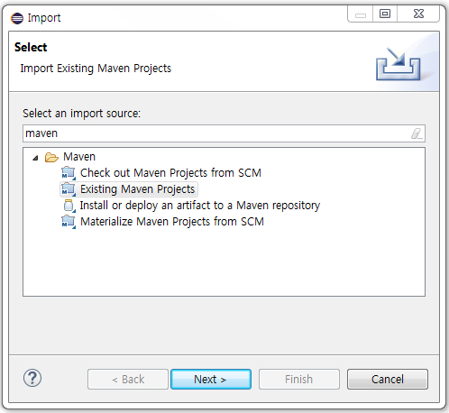
====

[caption="2) "]
.Select Root Directory (git repository) > Finish
====
.Maven Project import
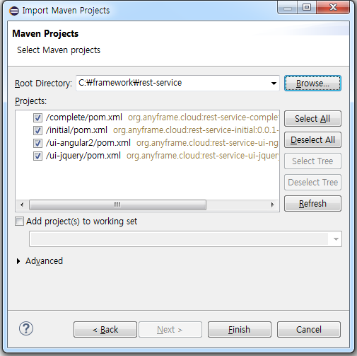
====

[caption="3) "]
.Complete
====
.Maven Project import
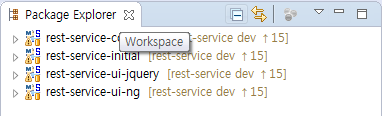
====

==== 2.(2) 실행하기

===== 2.(2).1) Maven Build로 실행

[caption="a. "]
.Project 선택 > 우클릭 > Run As > Maven Build... 선택
====
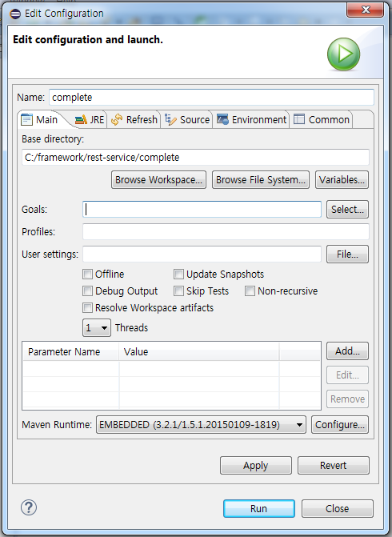
====

[caption="b. "]
.Goals 입력( spring-boot:run )
====
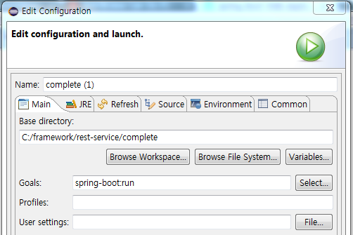
====

[caption="c. "]
.Complete
====
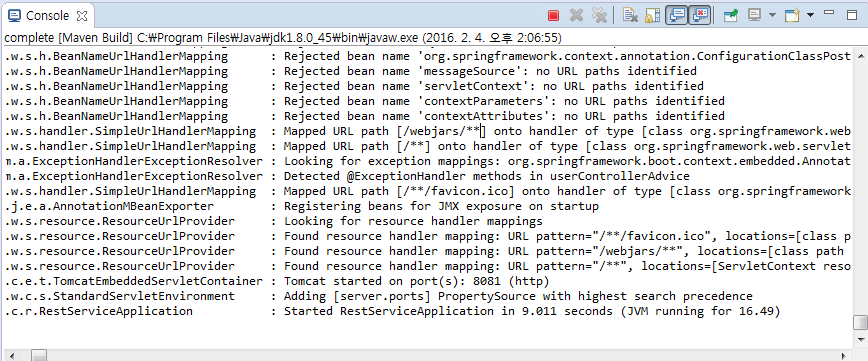
====

===== 2.(2).1) Java Application으로 실행

[caption=""]
.Project 선택 > 우클릭 > Run As > Java Application 선택
====
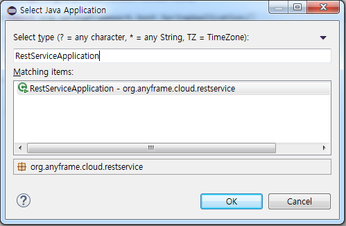
====

// Page 구분
<<<

[[main2]]
== API Test

[[section2-1]]
=== 1. Junit으로 테스트 하기
`Spring Test MVC`, `MockMVC` 를 이용하여 테스트를 수행합니다. 서버를 실행하고 실제 요청을 보내는 대신에 MockMVC을 이용하여 실제 WAS에서 Spring MVC가 `요청(request)` 에 `응답(response)` 하는 부분을 재현할 수 있습니다.
즉, 간단한 테스트 클래스의 실행만으로 URL, 헤더, 요청과 응답에 대한 정보 등등을 빠르게 확인할 수 있습니다. +
추가적으로 요청과 응답 데이터가 모두 JSON 방식이기 때문에 JSON 데이터를 테스트하기 위해서 `com.jayway.jsonpath` 라는 라이브러리를 사용합니다. +

==== 1.(1) 기본 설정
실제 테스트 코드를 작성하기 전에 기본 설정 부분의 소스입니다.
MockMVC 객체를 선언 및 생성하고, contentType과 테스트를 위한 기본 데이터를 셋팅합니다.

[source, java]
--------------------------------------------
@RunWith(SpringJUnit4ClassRunner.class)
@SpringApplicationConfiguration(classes = RestServiceApplication.class)
@WebAppConfiguration
public class CompleteApplicationTests {

	private MediaType contentType = new MediaType(MediaType.APPLICATION_JSON.getType(),
			MediaType.APPLICATION_JSON.getSubtype(),
			Charset.forName("utf8"));

	private MockMvc mockMvc;

	private User user = new User();

	@Autowired
	private RegisteredUserJpaRepository registeredUserJpaRepository;

	@Autowired
	private WebApplicationContext webApplicationContext;

	@Before
	public void setup() throws Exception {
		this.mockMvc = webAppContextSetup(webApplicationContext).build();

		this.registeredUserJpaRepository.deleteAllInBatch();

		this.user = registeredUserJpaRepository.save(new User("1234", "test", "test@anyframecloud.org", "kim", "test"));
	}
--------------------------------------------

[NOTE]
====
.`@WebAppConfiguration`
WebApplicationContext 를 생성할 수 있도록 하는 어노테이션

.`@Autowired WebApplicationContext webApplicationContext`
MockMVC 객체를 생성하기 위해 WebApplicationContext가 필요

.`this.mockMVC = webAppContextSetup(webApplicationContext).build()`
MockMVC 객체를 생성
====

==== 1.(2) 테스트 예제 (getUserById 메소드)
실제 테스트 코드를 작성하는 부분입니다. 기본적으로 `CRUD` 에 대한 테스트 중에서 `GET` 방식을 이용한 getUserById 에 대한 테스트 소스입니다. +
전체적인 테스트 STEP은 다음과 같습니다.

.. `/user/{userId}` 에 `GET` 으로 실행
.. HTTP 상태 코드가 `200` 인지 확인
.. content Type이 `application/json` 이고 character set이 `utf8` 인지 확인
.. `JsonPath` 표현인 $.을 이용하여 원하는 값인지 확인

[source, java]
--------------------------------------------
	@Test
	public void getUserById() throws Exception {
		mockMvc.perform(get("/user/"
				+ this.user.getId()))
				.andExpect(status().isOk())
				.andExpect(content().contentType(contentType))
				.andExpect(jsonPath("$.loginName", is(this.user.getLoginName())))
				.andExpect(jsonPath("$.emailAddress", is(this.user.getEmailAddress())))
				.andExpect(jsonPath("$.firstName", is(this.user.getFirstName())))
				.andExpect(jsonPath("$.lastName", is(this.user.getLastName())));
	}
--------------------------------------------

[NOTE]
====
.`mockMvc.perform(get("/user/" ...)`
WebApplicationContext 를 생성할 수 있도록 하는 어노테이션

.`.andExpect(...)`
요청에 대한 응답 정보를 확인

.`jsosnPath(...)`
JSON 형식의 데이터를 $.을 이용하여 확인
====

다른 테스트 케이스는 소스를 참고하시기 바랍니다. +

[[section2-2]]
=== 2. Postman으로 테스트하기

NOTE: Postman은 크롬 확장 어플리케이션 중 하나일 뿐 많은 RestAPI Test Tool이 존재합니다.(예> SOAP UI 등)

==== 2.(1) Request URL 및 Header
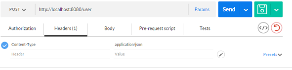

==== 2.(2) Request Body
[source, Json]
--------------------------------------------
{
    "loginName":"anyframecloud",
    "emailAddress":"anyframecloud@api.com",
    "firstName":"cloud",
    "lastName":"anyframe"
}
--------------------------------------------
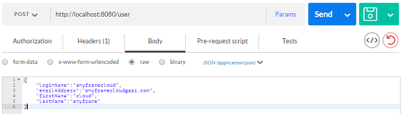

==== 2.(3) Response
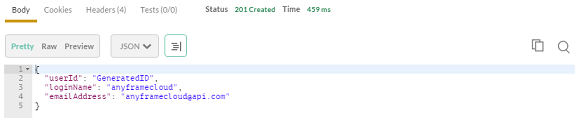

.. 응답코드 *_201 Created_* 를 확인할 수 있습니다.
.. Application Console에 Log를 통해 정상적으로 API 호출이 이뤄진 것을 확인할 수 있습니다.

[[section2-3]]
=== 3. curl로 테스트하기

==== 3.(1) curl로 API 호출하기
[source, Shell]
----
curl -X POST http://localhost:8081/user \
-H "Content-Type: application/json" \
-d '{"loginName":"anyframecloud","emailAddress":"cloud@api.com","firstName":"cloud","lastName":"anyframe"}'
----
NOTE: Window 사용자는 Git Bash로도 테스트가 가능합니다.

==== 3.(2) Response
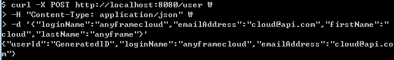

// Page 구분
<<<

[[outro]]
== Summary