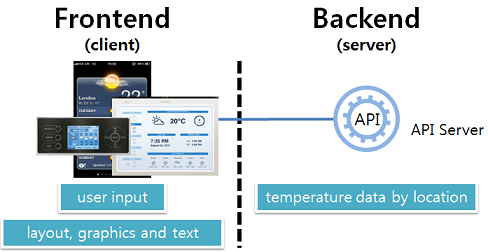
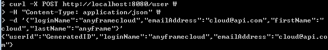
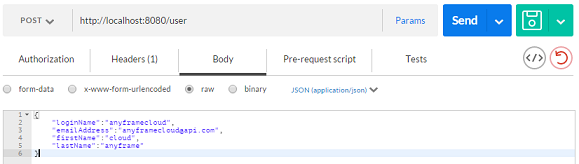

Getting Started
~~~~~~~~~~~~~~

= Consuming a RESTful API Service with AngularJS2

== 목차
..... *<<intro>>*

..... *<<main1>>*
        <<section1-1>>::
        
        <<section1-2>>::

..... *<<main2>>*
        <<section2-1>>::
			<<section2-1-1>>

        <<section2-2>>::
            <<section2-2-1>> +
            <<section2-2-2>> +
			<<section2-2-3>> +
			<<section2-2-4>> +
			<<section2-2-5>> +
			<<section2-2-6>>

        <<section2-3>>::
            <<section2-3-1>> +
            <<section2-3-2>> +
            <<section2-3-3>>

        <<section2-4>>::
            <<section2-4-1>> +
            <<section2-4-2>> +
			<<section2-4-3>> +
			<<section2-4-4>>

..... *<<outro>>*

// Page 구분
<<<

[[intro]]
== Introduce
*Spring Boot 기반의 link:http://spring.io/understanding/REST[REST] API 서비스 구축을 위한 레퍼런스 문서입니다.*

NOTE: RESTful API 설계 가이드는 link:설계가이드url[RESTful API 설계 가이드]를 참조 바랍니다.

=== Features
* Spring Boot를 이용하여 RESTful API Service를 구축합니다.
* API를 호출하는 다양한 Client의 Sample code를 제공합니다.
* link:https://www.w3.org/TR/cors[CORS(Cross-Origin Resource Sharing)]를 위한 해결책이 있습니다.
* 사용자 인증을 위해 link:http://oauth.net/2/[Oauth2.0] Client로써의 API Service를 구축합니다.

=== Need
* 약 15분의 시간
* Maven 3.0+
* java 7+
* IDE

// Page 구분
<<<

[[main1]]
== Architecture

[[section1-1]]
=== 1. 기존 Web Application
* 기존의 일반적인 Server Page 방식의 Web Application은 컴파일한 Page로 응답하기 때문에,
* Data만 주고 받기 위해 다른 방법을 강구해야만 했습니다.(별로 필요하지도 않았음)
* 예> 기상청으로부터 날씨정보를 받아오려면 OOO.jsp 파일로 부터 데이터를 추출하는 코드가 필요했습니다.

.기존 Web Application의 형태
image:image_server_page_archi.png[기존 Web Application의 형태]

[[section1-2]]
=== 2. RESTful API Service
* Client가 더욱 다양해지고 Web표준이 정립되면서 UI와 Data가 분리되었습니다.
* 이제 다양한 Client들에 동일한 Data로 응답하기 위해 Webservice 아키텍처가 Web Application에도 적용됩니다.

.RESTful Webservice API Service

// Page 구분
<<<

[[main2]]
== Build REST API Service
Spring Boot를 사용하여 손쉽게 API 서비스를 구축해 보겠습니다.

[[section2-1]]
=== 1. Clone Repository
----
git clone http://70.121.244.190/gitnsam/anyframe-cloud/rest-service.git
----

[[section2-1-1]]
=== 1.(1) 완성된 프로젝트
* 완성된 코드는 **_/complete_**에서 확인 할 수 있습니다.
* 개발 가이드를 실습 해보시려면 **_/initial_**을 본인의 IDE에 **_Maven Import_** 해주세요

.완성된 코드 실행하기
....
cd rest-service/complete
mvn spring-boot:run
....

// Page 구분
<<<

[[section2-2]]
=== 2. API 서비스 개발하기1
* 사용자 정보를 제공하는 API 서비스를 개발 해보겠습니다.
* 본 섹션에서는 Spring Boot를 기반으로 최소 기능을 구현합니다.

.제공할 자원(사용자 정보)
|===
|속성명 |타입 |설명
|id |long |시스템에서 관리되는 사용자 ID
|loginName |string |로그인 시 사용되는 이름
|emailAddress |string |사용자의 이메일 주소
|firstName |string |사용자의 이름
|lastName |string |사용자의 성
|===

[id="api_list",reftext="API 목록"]
.API 목록
|===
|URL |Method |Request |Response

|/user |POST |
POST /user HTTP/1.1  +
Conten-Type: application/json +
{ +
{nbsp}{nbsp}{nbsp} "loginName":"anyframecloud", +
{nbsp}{nbsp}{nbsp} "emailAddress":"cloud@api.com", +
{nbsp}{nbsp}{nbsp} "firstName":"cloud", +
{nbsp}{nbsp}{nbsp} "lastName":"anyframe" +
} |
HTTP/1.1 201 CREATED  +
{ +
{nbsp}{nbsp}{nbsp} "userId":"OOO", +
{nbsp}{nbsp}{nbsp} "loginName":"anyframecloud", +
{nbsp}{nbsp}{nbsp} "emailAddress":"cloud@api.com" +
}

|/user/{userId} |GET |
GET /user/{userId} HTTP/1.1
|
HTTP/1.1 200 OK +
{ +
{nbsp}{nbsp}{nbsp} "loginName":"anyframecloud", +
{nbsp}{nbsp}{nbsp} "emailAddress":"cloud@api.com", +
{nbsp}{nbsp}{nbsp} "firstName":"cloud", +
{nbsp}{nbsp}{nbsp} "lastName":"anyframe" +
}

|===

NOTE: API를 통해 서버의 자원을 제공한다는 관점에서 *Resource Server* 라는 용어를 사용하기도 합니다.

[[section2-2-1]]
==== 2.(1) pom.xml

===== 2.(1).1) **_spring-boot-starter-web_** 추가

.pom.xml
[source, xml]
----
<?xml version="1.0" encoding="UTF-8"?>
<project xmlns="http://maven.apache.org/POM/4.0.0" xmlns:xsi="http://www.w3.org/2001/XMLSchema-instance"
	xsi:schemaLocation="http://maven.apache.org/POM/4.0.0 http://maven.apache.org/xsd/maven-4.0.0.xsd">
	<modelVersion>4.0.0</modelVersion>

	<groupId>org.anyframe.cloud</groupId>
	<artifactId>rest-service</artifactId>
	<version>0.0.1-SNAPSHOT</version>
	<packaging>jar</packaging>

	<name>rest-service</name>
	<description>Demo project for RESTful API Service</description>

	<parent>
		<groupId>org.springframework.boot</groupId>
		<artifactId>spring-boot-starter-parent</artifactId>
		<version>1.3.1.RELEASE</version>
		<relativePath/> <!-- lookup parent from repository -->
	</parent>

	<properties>
		<project.build.sourceEncoding>UTF-8</project.build.sourceEncoding>
		<java.version>1.7</java.version>
	</properties>

	<dependencies>
		<dependency>
			<groupId>org.springframework.boot</groupId>
			<artifactId>spring-boot-starter-web</artifactId>
		</dependency>

		<dependency>
			<groupId>org.springframework.boot</groupId>
			<artifactId>spring-boot-starter-test</artifactId>
			<scope>test</scope>
		</dependency>
	</dependencies>

	<build>
		<plugins>
			<plugin>
				<groupId>org.springframework.boot</groupId>
				<artifactId>spring-boot-maven-plugin</artifactId>
			</plugin>
		</plugins>
	</build>
</project>
----
NOTE: Application을 쉽게 구동하기 위해서 **_spring-boot-maven-plugin_**을 추가해 주었습니다.

[[section2-2-2]]
==== 2.(2) Resource Domain Class
* 도메인 설계에 따라 Domain Class를 작성해보겠습니다.

===== 2.(2).1) *_org.anyframe.cloud.rest.domain.User_* Class를 생성

.User.class
[source, java]
----
package org.anyframe.cloud.restservice.domain;

public class User {

    private String id;

    private String loginName;

    private String emailAddress;

    private String firstName;

    private String lastName;

    public User() {
    }

    public User(String id, String loginName, String emailAddress, String firstName, String lastName) {
        this.id = id;
        this.loginName = loginName;
        this.emailAddress = emailAddress;
        this.firstName = firstName;
        this.lastName = lastName;
    }

    public String getId() {
        return id;
    }

    public void setId(String id) {
        this.id = id;
    }

    public String getLoginName() {
        return loginName;
    }

    public void setLoginName(String loginName) {
        this.loginName = loginName;
    }

    public String getEmailAddress() {
        return emailAddress;
    }

    public void setEmailAddress(String emailAddress) {
        this.emailAddress = emailAddress;
    }

    public String getFirstName() {
        return firstName;
    }

    public void setFirstName(String firstName) {
        this.firstName = firstName;
    }

    public String getLastName() {
        return lastName;
    }

    public void setLastName(String lastName) {
        this.lastName = lastName;
    }

    @Override
    public String toString() {
        return "User{" +
                "id='" + id + '\'' +
                ", loginName='" + loginName + '\'' +
                ", emailAddress='" + emailAddress + '\'' +
                ", firstName='" + firstName + '\'' +
                ", lastName='" + lastName + '\'' +
                '}';
    }
}
----
.. Domain Class는 Database에 매핑됩니다.
.. 기본적인 Getter, Setter Method와 toString()만 존재하지만 *equals()*, *hashCode()* 등의 유틸성 메소드를 추가해도 무관합니다.

NOTE: 본 Sample Application은 Repository가 존재하지 않아 JPA관련 Annotation이 누락되어 있습니다.(@Entity, @Id 등)

[[section2-2-3]]
==== 2.(3) Resource Controller Class
* API 목록에 따라 Controller Class를 작성해보겠습니다.

===== 2.(3).1) *_org.anyframe.cloud.rest.interfaces.rest.UserContoller_* Class 생성

.UserContoller.class
[source, java]
----
package org.anyframe.cloud.restservice.controller.rest;

import org.anyframe.cloud.restservice.service.UserService;
import org.anyframe.cloud.restservice.controller.dto.RegisterUser;
import org.slf4j.Logger;
import org.slf4j.LoggerFactory;
import org.springframework.beans.factory.annotation.Autowired;
import org.springframework.http.HttpStatus;
import org.springframework.web.bind.annotation.*;

@RestController(value = "/user")
public class UserController {

  private static final Logger logger = LoggerFactory.getLogger(UserController.class);

  @Autowired
  private UserService userService;

  @RequestMapping(method = {RequestMethod.POST})
  @ResponseStatus(HttpStatus.CREATED)
  public User registerUser(@RequestBody User registerUser) {

	  User registeredUser = userService.registerUser(registerUser);

	  return registeredUser;
  }

}
----
.. @RestController
** Spring 4.0 부터 추가된 Spring MVC에서 사용되는 Annotation.
** @Controller + @ResponseBody를 대체하기 위해 새롭게 추가되었다.
** Return 값은 View 없이 특정 Type의 메시지가 Response Body에 직접 쓰여진다.

.. @RequestMapping
** method: Http Request Method(POST, PUT, DELETE, GET...)
** value: 매핑되는 context root 이후의 URL이며, Method의 값은 Class의 @RequestMapping(value)를 상속한다.

.. @RequestBody
** RequestBody의 내용이 Messageconverter를 통해 Domain Class에 매핑된다.

[[section2-2-4]]
==== 2.(4) Service Class
* 실제로 Business Logic을 담당하는 Class를 작성해보겠습니다.

NOTE: 본 샘플 Application에서는 Logging으로 대체하겠습니다.

===== 2.(4).1) *_org.anyframe.cloud.rest.application.UserService_* Interface 생성

.UserService.class
[source, java]
----
package org.anyframe.cloud.restservice.service;

import org.anyframe.cloud.restservice.domain.User;

public interface UserService {

    User registerUser(User newUser);

}
----

===== 2.(4).2) *_org.anyframe.cloud.rest.application.internal.UserServiceImpl_* Class 생성

.UserServiceImpl.class
[source, java]
----
package org.anyframe.cloud.restservice.service.implement;

import org.anyframe.cloud.restservice.service.UserService;
import org.anyframe.cloud.restservice.domain.User;
import org.slf4j.Logger;
import org.slf4j.LoggerFactory;
import org.springframework.stereotype.Service;

@Service
public class UserServiceImpl implements UserService {

    private static final Logger logger = LoggerFactory.getLogger(UserServiceImpl.class);

    @Override
    public User registerUser(User newUser) {
        logger.info("$$$ registerUser - new user : ".concat(newUser.toString()));

        newUser.setId("GeneratedID");

        User registeredUser = newUser;
        logger.info("$$$ registerUser - registered user : ".concat(registeredUser.toString()));

        return registeredUser;
    }

}
----
.. 단순히 Logging만 하는 Sample용 코드입니다.

[[section2-2-5]]
==== 2.(5) Method 추가하기
* 동일하게 GET, PUT, DELETE에 해당되는 메소드를 작성합니다.

[[section2-2-6]]
==== 2.(6) Data Transfer Object 작성하기
* Sample Application의 패키지 구조는 크게 세가지로 나눌 수 있습니다.
  .. interface
  .. application
  .. repository(현재 생략됨)
* 기본적으로 application과 repository는 DB와 매핑되는 Domain 객체를 사용하지만,
* RESTful webservice API로 노출되는 객체로 Domain 객체를 사용하는 것은 API 사용자(Client)에게는 큰 불편입니다.
* *_즉, DTO는 API 스펙과 매핑되는 객체입니다._*

[NOTE]
.Data Transfer Object가 필요한 이유
===================================
. API 스펙은 버전별로 변화가 거의 없어야 하는데 DB 모델링 변화에 따라 Domain 객체는 수시로 변할 수 있다.
. Domain 객체는 DB와 매핑되므로 사용자에게 불필요한 시스템 컬럼이 포함되어있다.
. 동일한 Domain의 정보를 제공하더라도, API 별 특성에 따라 제공하고자 하는 데이터가 상이한 경우가 있다.
===================================

.새롭게 추가될 2개의 Data Transfer Object
. 회원가입 사용자 DTO: RegisteredUser
  .. POST /user의 Request
  .. GET /user/{userId}의 Response
. 사용자 계정 DTO: UserAccount
  .. POST /user의 Response

.Data Transfer Object 작성하기
===== 2.(6).1) *_org.anyframe.cloud.rest.interfaces.dto.RegisteredUser_* Class 생성

.RegisteredUser.class
[source, java]
----
package org.anyframe.cloud.restservice.controller.dto;

public class RegisteredUser {

    private String loginName;

    private String emailAddress;

    private String firstName;

    private String lastName;

    public RegisteredUser() {
    }

    public RegisteredUser(String loginName, String emailAddress, String firstName, String lastName) {
        this.loginName = loginName;
        this.emailAddress = emailAddress;
        this.firstName = firstName;
        this.lastName = lastName;
    }

    public String getLoginName() {
        return loginName;
    }

    public void setLoginName(String loginName) {
        this.loginName = loginName;
    }

    public String getEmailAddress() {
        return emailAddress;
    }

    public void setEmailAddress(String emailAddress) {
        this.emailAddress = emailAddress;
    }

    public String getFirstName() {
        return firstName;
    }

    public void setFirstName(String firstName) {
        this.firstName = firstName;
    }

    public String getLastName() {
        return lastName;
    }

    public void setLastName(String lastName) {
        this.lastName = lastName;
    }

    @Override
    public String toString() {
        return "RegisteredUser{" +
                "loginName='" + loginName + '\'' +
                ", emailAddress='" + emailAddress + '\'' +
                ", firstName='" + firstName + '\'' +
                ", lastName='" + lastName + '\'' +
                '}';
    }
}

----

===== 2.(6).2) *_org.anyframe.cloud.rest.interfaces.dto.UserAccount_* Class 생성

.UserAccount.class
[source, java]
----
package org.anyframe.cloud.restservice.controller.dto;

public class UserAccount {

    private String userId;

    private String loginName;

    private String emailAddress;

    public UserAccount() {
    }

    public UserAccount(String userId, String loginName, String emailAddress) {
        this.userId = userId;
        this.loginName = loginName;
        this.emailAddress = emailAddress;
    }

    public String getUserId() {
        return userId;
    }

    public void setUserId(String userId) {
        this.userId = userId;
    }

    public String getLoginName() {
        return loginName;
    }

    public void setLoginName(String loginName) {
        this.loginName = loginName;
    }

    public String getEmailAddress() {
        return emailAddress;
    }

    public void setEmailAddress(String emailAddress) {
        this.emailAddress = emailAddress;
    }

    @Override
    public String toString() {
        return "UserAccount{" +
                "userId='" + userId + '\'' +
                ", loginName='" + loginName + '\'' +
                ", emailAddress='" + emailAddress + '\'' +
                '}';
    }
}
----

===== 2.(6).3) DTO - Domain 매핑하기

.UserController.class
[source, java]
----
@RestController(value = "/user")
public class UserController {

    private static final Logger logger = LoggerFactory.getLogger(UserController.class);

    @Autowired
    private UserService userService;

    @RequestMapping(method = {RequestMethod.POST})
    @ResponseStatus(HttpStatus.CREATED)
    public UserAccount registerUser(@RequestBody RegisteredUser registerUser) {

        User newUser = new User(null
                , registerUser.getLoginName()
                , registerUser.getEmailAddress()
                , registerUser.getFirstName()
                , registerUser.getLastName());

        User user = userService.registerUser(newUser);

        UserAccount userAccount = new UserAccount(user.getId()
                , user.getLoginName()
                , user.getEmailAddress());

        return userAccount;
    }

    @RequestMapping(value={"/{userId}"}, method = {RequestMethod.GET})
    @ResponseStatus(HttpStatus.OK)
    public RegisteredUser registerUser(@PathVariable(value = "userId") String userId) {

        User user = userService.getUserById(userId);

        RegisteredUser registeredUser = new RegisteredUser(user.getLoginName()
                , user.getEmailAddress()
                , user.getFirstName()
                , user.getLastName());

        return registeredUser;

    }

}
----
NOTE: DTO와 Domain을 매핑을 위해 Facade Layer를 추가할 수도 있지만, Sample Project에서는 그 역할을 Controller가 담당합니다.

// Page 구분
<<<

[[section2-3]]
=== 3. API Test

[[section2-3-1]]
[id="run_app",reftext="Run Sample Application"]
==== 3.(1) Run Sample Application

.실행하기
....
cd rest-service/complete
mvn spring-boot:run
....

[[section2-3-2]]
==== 3.(2) curl로 테스트하기

===== 3.(2).1) curl로 API 호출하기
[source, Shell]
----
curl -X POST http://localhost:8081/user \
-H "Content-Type: application/json" \
-d '{"loginName":"anyframecloud","emailAddress":"cloud@api.com","firstName":"cloud","lastName":"anyframe"}'
----
NOTE: Window 사용자는 Git Bash로도 테스트가 가능합니다.

===== 3.(2).2) Response

[[section2-3-3]]
=== 3.(3) Postman으로 테스트하기

NOTE: Postman은 크롬 확장 어플리케이션 중 하나일 뿐 많은 RestAPI Test Tool이 존재합니다.(예> SOAP UI 등)

===== 3.(3).1) Request URL 및 Header
image:image_postman_header.png[Postman Header]

===== 3.(3).2) Request Body
[source, Json]
--------------------------------------------
{
    "loginName":"anyframecloud",
    "emailAddress":"anyframecloud@api.com",
    "firstName":"cloud",
    "lastName":"anyframe"
}
--------------------------------------------

===== 3.(3).3) Response
image:image_postman_response.png[Postman Response]

.. 응답코드 *_201 Created_* 를 확인할 수 있습니다.
.. Application Console에 Log를 통해 정상적으로 API 호출이 이뤄진 것을 확인할 수 있습니다.

// Page 구분
<<<

[[section2-4]]
=== 4. API 서비스 개발하기2
* 본 섹션에서는 API 서비스가 가져야하는 필수 기능들에 대해 다루겠습니다.
* 기능 특성에 따라 일부는 본 가이드에서 분리되어 독립적으로 제공됩니다.

[[section2-4-1]]
==== 4.(1) 에러 처리하기

===== 4.(1).1) Http Status Code
* 에러를 다루기 이전에 RESTful 하게 주요 HTTP 상태코드에 대해서 알아보겠습니다.
* API의 응답코드로 사용될만한 코드를 중심으로 소개하겠습니다.

.link:https://en.wikipedia.org/wiki/List_of_HTTP_status_codes[HTTP Status Code]
|===
|Code|Message |Description
|200 |OK(성공) |서버가 요청을 제대로 처리
|201 |Created(작성됨) |성공적으로 요청되었으며 서버가 새 리소스를 작성했다.
|204 |No Content(컨텐츠 없음) |서버가 요청을 성공적으로 처리했지만 콘텐츠를 제공하지 않는다.
|301 |Moved Permanently(영구 이동) |요청한 페이지를 새 위치로 영구적으로 이동했다. GET 또는 HEAD 요청에 대한 응답으로 이 응답을 표시하면 요청자가 자동으로 새 위치로 전달된다.
|400 |Bad Request(잘못된 요청) |서버가 요청의 구문을 인식하지 못했다.
|401 |Unauthorized(권한 없음) |이 요청은 인증이 필요하다. 서버는 로그인이 필요한 페이지에 대해 이 요청을 제공할 수 있다.
|404 |Not Found(찾을 수 없음) |서버가 요청한 컨텐츠를 찾을 수 없다.
|409 |Conflict(충돌) |서버가 요청을 수행하는 중에 충돌이 발생했다. 서버는 응답할 때 충돌에 대한 정보를 포함해야 한다. 서버는 PUT 요청과 충돌하는 PUT 요청에 대한 응답으로 이 코드를 요청 간 차이점 목록과 함께 표시해야 한다.
|410 |Gone(사라짐) |서버는 요청한 리소스가 영구적으로 삭제되었을 때 이 응답을 표시한다. 404(찾을 수 없음) 코드와 비슷하며 이전에 있었지만 더 이상 존재하지 않는 리소스에 대해 404 대신 사용하기도 한다. 리소스가 영구적으로 이동된 경우 301을 사용하여 리소스의 새 위치를 지정해야 한다.
|500 |Internal Server Error(내부 서버 오류) |서버에 오류가 발생하여 요청을 수행할 수 없다.
|===
NOTE: link:http://www.iana.org/assignments/http-status-codes/http-status-codes.xhtml[공식사이트]의 상세 Spec을 통해 상황에 따라 적합한 상태코드를 찾아보세요.

===== 4.(1).2) Business Exception 설계

[NOTE]
====
Business Exception 설계는 API 설계 시 완료되어야 하는 부분이지만, +
가이드 문서 편의상 지금 진행하겠습니다. +
참고: Sample Project의 <<api_list>>
====

* 여러 상황에 대해 오류처리가 가능하지만
* Sample Project인 만큼 간편하게 케이스를 다루겠습니다.

.오류 발생 상황
회원가입 시 admin이라는 loginName으로 등록 경우 LoginName 중복 오류 발생

* *POST /user*
* Exception: *DuplicateLoginNameException*
* HTTP Staus Code: *209 Conflict*
* Response:
[source, json]
{
   "timestamp": 1453350197105,
   "status": 209,
   "error": "Duplicate loginName value",
   "errorCode": "TEST0001"
   "exception": "DuplicateLoginNameException"
}

===== 4.(1).3) ExceptionHandler 등록
[NOTE]
====
아래의 내용은 Spring 3.x 이하의 버전의 ExceptionHandler와 동일한 기능을 수행합니다. +
하지만 사용하는 방법에 있어 차이가 있을 수 있습니다.
====

.UserController.class
[source, java]
----
// 생략
@ExceptionHandler(DuplicateLoginNameException.class)
@ResponseStatus(value = HttpStatus.CONFLICT, reason = "Duplicate loginName value")
public void duplicateLoginName() {
    logger.error("[DuplicateLoginNameException] - LoginName is already in use.");
}
// 생략
----

===== 4.(1).4) DuplicateLoginNameException Class 생성

.DuplicateLoginNameException.class
[source, java]
----
package org.anyframe.cloud.restservice.service.exception;

public class DuplicateLoginNameException extends RuntimeException {
}
----
.. application package 하위에 exception package에 생성합니다.
.. 추가적으로 구현할 기능요건이 없으므로 *_RuntimeException_* 만 상속합니다.

NOTE: Exception Class 생성 시 패키지나, 부모클래스, 구현내용 등은 솔루션 표준에 의거 작성하면 됩니다.

===== 4.(1).5) Business Logic 추가

.UserServiceImpl.class
[source, java]
----
// 생략
@Override
public User registerUser(User newUser) {
    logger.info("$$$ registerUser - new user : ".concat(newUser.toString()));

    if("admin".equals(newUser.getLoginName())){
        throw new DuplicateLoginNameException();
    }

    newUser.setId("GeneratedID");

    User registeredUser = newUser;
    logger.info("$$$ registerUser - registered user : ".concat(registeredUser.toString()));

    return registeredUser;
}
// 생략
----
.. DuplicateLoginNameException 발생을 위해 "admin"과 비교하는 if문을 작성합니다.

===== 4.(1).6) 오류처리 테스트

. 서버를 구동합니다.(<<run_app>>)
. curl 호출 방식을 통해 회원가입(POST /user) 요청

.curl 요청
[source, Shell]
----
curl -X POST http://localhost:8081/user \
-H "Content-Type: application/json" \
-d '{"loginName":"admin","emailAddress":"cloud@api.com","firstName":"cloud","lastName":"anyframe"}'
----

.Response Body
[source, Json]
----
{
  "timestamp": 1453361729003,
  "status": 409,
  "error": "Conflict",
  "exception": "org.anyframe.cloud.restservice.service.exception.DuplicateLoginNameException",
  "message": "Duplicate loginName value",
  "path": "/user"
}
----
[NOTE]
====
오류처리에 대한 응답 메시지가 설계와 다른 모습을 볼 수가 있습니다. +
Spring Boot Web Starter에 의해 기본 메시지 타입이 사용됐기 때문입니다.
====

[TIP]
====
.Spring Boot의 Default 오류처리
. 처리하는 Controller
 * org.springframework.boot.autoconfigure.web.BasicErrorController
. ResponseEntity 항목 구성
 * org.springframework.boot.autoconfigure.web.DefaultErrorAttributes
====

===== 4.(1).7) Error Type Customizing

* 최초 설계하였던 오류메시지 형식에 맞도록 Customizing 해보겠습니다.

.Custom Error Type Class 생성하기
[source, Java]
----
package org.anyframe.cloud.restservice.controller.dto;

import java.util.Date;

public class SampleError {

    private Date timestamp;

    private int status;

    private String errorCode;

    private String error;

    private String exception;

    public SampleError() {
    }

    public SampleError(Date timestamp, int status, String errorCode, String error, String exception) {
        this.timestamp = timestamp;
        this.status = status;
        this.errorCode = errorCode;
        this.error = error;
        this.exception = exception;
    }

    public Date getTimestamp() {
        return timestamp;
    }

    public void setTimestamp(Date timestamp) {
        this.timestamp = timestamp;
    }

    public int getStatus() {
        return status;
    }

    public void setStatus(int status) {
        this.status = status;
    }

    public String getErrorCode() {
        return errorCode;
    }

    public void setErrorCode(String errorCode) {
        this.errorCode = errorCode;
    }

    public String getError() {
        return error;
    }

    public void setError(String error) {
        this.error = error;
    }

    public String getException() {
        return exception;
    }

    public void setException(String exception) {
        this.exception = exception;
    }
}
----

.ControllerAdvice 생성하기
[source, Java]
----
package org.anyframe.cloud.restservice.controller.rest;

import org.anyframe.cloud.restservice.service.exception.DuplicateLoginNameException;
import org.anyframe.cloud.restservice.controller.dto.SampleError;
import org.slf4j.Logger;
import org.slf4j.LoggerFactory;
import org.springframework.http.HttpStatus;
import org.springframework.http.ResponseEntity;
import org.springframework.web.bind.annotation.ControllerAdvice;
import org.springframework.web.bind.annotation.ExceptionHandler;
import org.springframework.web.bind.annotation.ResponseBody;
import org.springframework.web.servlet.mvc.method.annotation.ResponseEntityExceptionHandler;

import javax.servlet.http.HttpServletRequest;
import java.util.Date;

@ControllerAdvice(basePackageClasses  = UserController.class)
public class UserControllerAdvice extends ResponseEntityExceptionHandler {

    private static final Logger logger = LoggerFactory.getLogger(UserControllerAdvice.class);

    @ExceptionHandler(DuplicateLoginNameException.class)
    @ResponseBody
    ResponseEntity<?> duplicateLoginName(HttpServletRequest request, Throwable ex) {

        logger.error("[DuplicateLoginNameException] - LoginName is already in use.");

        HttpStatus status = HttpStatus.valueOf(409);

        return new ResponseEntity<>(
                new SampleError(new Date()
                    , status.value()
                    , "TEST00001"
                    , ex.getMessage()
                    , ex.getClass().getSimpleName())
                , HttpStatus.valueOf(409));
    }
}
----
. 기존에 UserController에 있던 @ExceptionHandler 메소드를 삭제합니다.
. @ControllerAdvice Class 생성
.. 일반적으로 모든 @RequestMapping 방법에 적용되는 @ExceptionHandler, @InitBinder, 및 @ModelAttribute 방법을 정의하는데 사용됩니다.
. @ExceptionHandler 메소드 구현
.. ResponseEntityExceptionHandler를 상속하고 메소드에 @ResponseBody를 추가함으로써 Exception 처리 후 BasicErrorController를 거치지 않고 응답합니다.

[TIP]
====
@ControllerAdvice 대신 오류 메시지 타입을 재정의하는 또 다른 방법으로는 BasicErrorController를 상속하는 방법이 있습니다.
====

===== 4.(1).8) 오류처리 테스트

. 서버를 구동합니다.(<<run_app>>)
. curl 호출 방식을 통해 회원가입(POST /user) 요청

.curl 요청
[source, Shell]
----
curl -X POST http://localhost:8081/user \
-H "Content-Type: application/json" \
-d '{"loginName":"admin","emailAddress":"cloud@api.com","firstName":"cloud","lastName":"anyframe"}'
----

.Response Body
[source, Json]
----
{
  "timestamp": 1453438312522,
  "status": 409,
  "errorCode": "TEST00001",
  "error": "dup",
  "exception": "DuplicateLoginNameException"
}
----
NOTE: 응답 메시지 타입이 변경된 것을 확인할 수 있습니다.

[[section2-4-2]]
==== 4.(2) CORS(Cross-Origin Resource Sharing)

[[section2-4-3]]
==== 4.(3) Ceal으로 보안 강화하기

[[section2-4-4]]
==== 4.(4) OAuth 2.0 클라이언트로서의 API Service

[[section2-4-5]]
==== 4.(5) Ceal으로 보안 강화하기

// Page 구분
<<<

[[outro]]
== Summary
굉장히 간단한 Spring Boot 기반의 RESTfull API Service 구축을 실습했습니다. +
link:./consuming_restful_api.adoc[다음 가이드]에서는 API 클라이언트로써 간단한 UI Application 개발을 실습해보도록 하겠습니다.

[NOTE]
.아직 가이드에 추가되지 않은 내용입니다.
====
* Security
* Oauth2.0
====