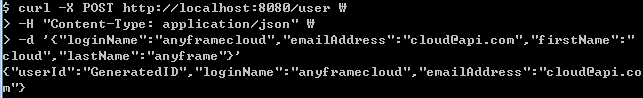
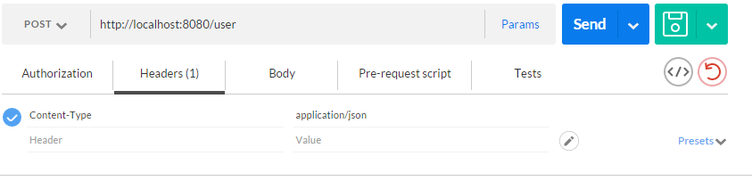
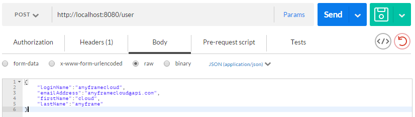
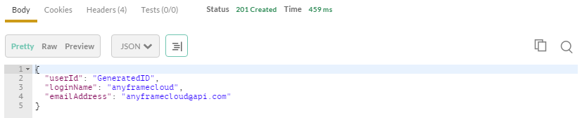

Getting Started
~~~~~~~~~~~~~~

Building RESTful API Service
===========================

== 목차
..... *<<intro>>*

..... *<<main1>>*
        <<section1-1>>::
        
        <<section1-2>>::

..... *<<main2>>*
        <<section2-1>>::
			<<section2-1-1>>

        <<section2-2>>::
            <<section2-2-1>> +
            <<section2-2-2>> +
			<<section2-2-3>> +
			<<section2-2-4>> +
			<<section2-2-5>> +
			<<section2-2-6>>

        <<section2-3>>::
            <<section2-3-1>> +
            <<section2-3-2>> +
            <<section2-3-3>>

        <<section2-4>>::
            <<section2-4-1>> +
            <<section2-4-2>> +
			<<section2-4-3>> +
			<<section2-4-4>>

..... *<<outro>>*

// Page 구분
<<<

[[intro]]
== Introduce

=== Features
* Spring Boot를 이용하여 RESTful API Service를 구축합니다.

=== Need
* 약 15분의 시간

// Page 구분
<<<

[[section2-3]]
=== 3. API Test

[[section2-3-1]]
[id="run_app",reftext="Run Sample Application"]
==== 3.(1) Run Sample Application

.실행하기
....
cd rest-service/complete
mvn spring-boot:run
....

[[section2-3-2]]
==== 3.(2) curl로 테스트하기

===== 3.(2).1) curl로 API 호출하기
[source, Shell]
----
curl -X POST http://localhost:8081/user \
-H "Content-Type: application/json" \
-d '{"loginName":"anyframecloud","emailAddress":"cloud@api.com","firstName":"cloud","lastName":"anyframe"}'
----
NOTE: Window 사용자는 Git Bash로도 테스트가 가능합니다.

===== 3.(2).2) Response

[[section2-3-3]]
=== 3.(3) Postman으로 테스트하기

NOTE: Postman은 크롬 확장 어플리케이션 중 하나일 뿐 많은 RestAPI Test Tool이 존재합니다.(예> SOAP UI 등)

===== 3.(3).1) Request URL 및 Header

===== 3.(3).2) Request Body
[source, Json]
--------------------------------------------
{
    "loginName":"anyframecloud",
    "emailAddress":"anyframecloud@api.com",
    "firstName":"cloud",
    "lastName":"anyframe"
}
--------------------------------------------

===== 3.(3).3) Response

.. 응답코드 *_201 Created_* 를 확인할 수 있습니다.
.. Application Console에 Log를 통해 정상적으로 API 호출이 이뤄진 것을 확인할 수 있습니다.

// Page 구분
<<<

[[outro]]
== Summary